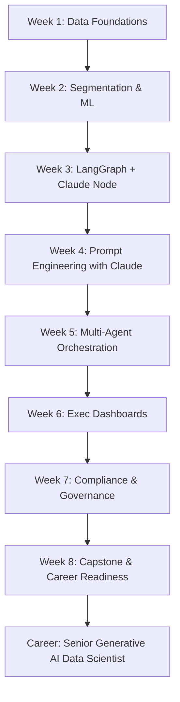

# 🚀 Senior Generative AI Data Scientist Roadmap  

*8-Week Applied Course Using `ai-marketing-agents` Project*  

---

## 📛 Tech Stack & Values  

### 🔧 Core Technologies  
  
  
  
  
  
  
  
  
  
  
  
  
  

### 🌍 Values & Positioning  
  
  
  
  
  

---

## 🎯 Why This Matters

This repo demonstrates a **real-world Generative AI system**:

* Data connectors (SQLite/Postgres)
* Customer segmentation (KMeans, feature store)
* Agentic workflows (LangGraph + Claude Code)
* A Streamlit dashboard for executives
* Compliance, privacy, and audit logging

Employers want **hands-on proof** that you can:

* Build **end-to-end AI pipelines**
* Use **Claude Code** for safe, enterprise-ready reasoning
* Combine **ML + LLMs** for business outcomes
* Deploy with guardrails, governance, and ROI visibility

---

## 📅 8-Week Course Outline

### Week 1: Data Foundations for AI Systems

* Learn database connections (SQLite → Postgres).
* Feature engineering: `purchase_frequency`, recency, rating.
* Lab: Build and store features in SQLite.

### Week 2: Segmentation & Classical ML for Business AI

* Apply clustering (KMeans, silhouette validation).
* Human-readable segment naming.
* Lab: Generate `customer_features` with clusters.

### Week 3: Agentic Workflows 101 (LangGraph + Claude)

* Build your first **Claude-powered node** (`segment_analyzer`).
* Visualize workflow: **START → Claude Node → END**.
* Lab: Connect LangGraph to Claude API (Anthropic SDK).

```python
from anthropic import Anthropic

client = Anthropic(api_key="YOUR_ANTHROPIC_KEY")
resp = client.messages.create(
    model="claude-3-opus-20240229",
    max_tokens=500,
    messages=[{"role":"user","content":"Analyze this customer segment and return insights as JSON"}]
)
print(resp.content)
```

### Week 4: Prompt Engineering with Claude Code

* Learn **structured prompting** with JSON schemas.
* Design safe outputs for downstream BI/Marketing.
* Lab: Build a Claude template that enforces `response`, `insights`, `summary_table`.

### Week 5: Multi-Agent Collaboration with LangChain & LangGraph

* Use LangChain **PromptTemplate → Claude → OutputParser**.
* Integrate into LangGraph: Supervisor → BI → Product → Email Writer.
* Lab: Orchestrate a workflow where Claude generates **BI insights + email drafts**.

### Week 6: Visualization & Executive Dashboards

* Build **Streamlit + Plotly** dashboards.
* Exec metrics: segment size, p1 scores, campaign ROI.
* Lab: Deploy dashboard locally.

### Week 7: Compliance, Ethics & Enterprise AI

* Implement guardrails: suppression lists, opt-out fields, audit logging.
* Discuss Claude’s focus on **safety-first AI**.
* Lab: Extend config for compliance enforcement.

### Week 8: Capstone & Career Readiness

* Full workflow: Data → Segmentation → Claude Agents → Exec UI → Compliance.
* Deliverables:

  * BI lead list
  * Product talking points
  * Email drafts
  * Exec dashboard demo
* Career prep: case study + interview practice.

---

## 🛠 Skills You’ll Gain by Week 8

* **Data Science Core**: pipelines, clustering, feature engineering.
* **GenAI Systems**: Claude Code + LangChain + LangGraph orchestration.
* **Deployment**: Streamlit dashboards, SQL backends.
* **Compliance**: Audit logs, opt-out enforcement.
* **Leadership Readiness**: Explain ROI and ethics to execs.

---

## 🏁 Next Steps After This Course

* Extend to **multi-touch attribution models**.
* Add **RAG on brand assets**.
* Deploy to **low-cost cloud (Render/Fly/Railway)**.
* Mentor juniors to reinforce mastery.

---

## 💼 Career Positioning

By documenting this journey:

* You prove **end-to-end Generative AI system design**.
* You show **Claude Code expertise** (a differentiator in enterprise hiring).
* You position yourself as **ready for Senior Generative AI Data Scientist roles**.

---

## 📊 Course Workflow (Mermaid Diagram)



## License
This project is licensed under the Defensive AI Commercial Rights (DACR) License.  
See the [LICENSE](./LICENSE) file for details.

