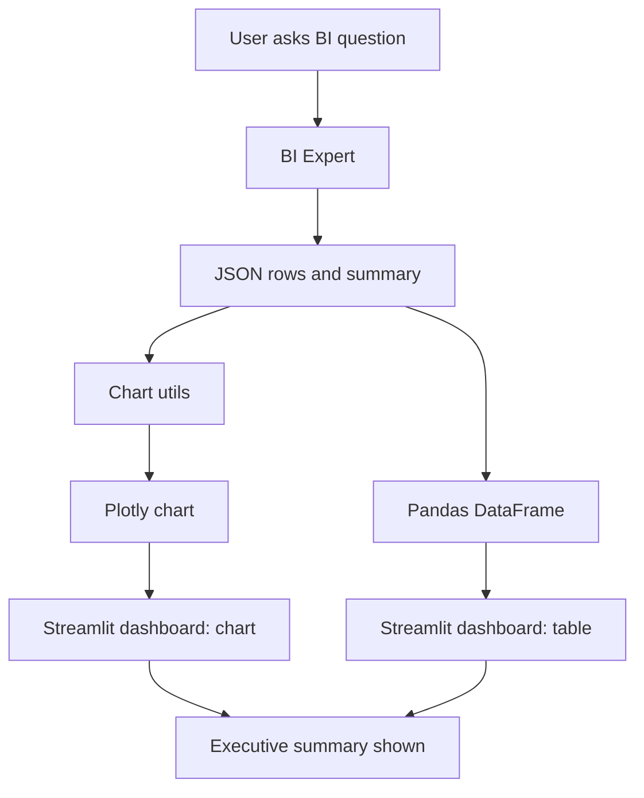

# 📘 Week 1 — Day 7

**Topic:** Visualizing BI Outputs with Plotly + Streamlit

---

## 🎯 Learning Objectives

* Learn how to **turn BI JSON rows into charts** using Plotly.
* Decide which **chart type** fits the question (bar/line/scatter).
* Add charts to your **Streamlit dashboard** next to BI tables and summaries.
* Keep visuals **professional and consistent** with a dark theme.

---

## 🗂 What’s Included

* `chart_utils.py` → helpers that convert BI `rows` → Plotly figures
* `bi_charts.py` → runs the BI Expert, returns `DataFrame`, `Figure`, and summary
* `dashboard_charts.py` → a Streamlit app with **tables + charts**
* (Optional) `style.css` → reuse your Day 6 dark theme

> Re-uses:
>
> * Day 5 BI runner: `exec_bi`

---

## 🧩 Prerequisites

* `.env` file already set up from earlier days
* Required installs (if not already installed):

  ```bash
  pip install plotly streamlit pandas
  ```

---

## ▶️ How to Run (Step-by-Step)

1. **Go to your Day 7 folder**

   ```bash
   cd ai-marketing-agents-course/course/week1/day7
   ```

2. **Start the dashboard**

   ```bash
   streamlit run dashboard_charts.py
   ```

3. **Open in browser**

   * Go to [http://localhost:8501](http://localhost:8501)
   * You’ll see a dashboard with tables **and charts**

---

## 📊 Visual Workflow



---

## 🧠 Design Notes (Plain English)

* **What gets charted?**

  * If the template = `avg_p1_by_segment` → bar chart (segment vs avg\_p1)
  * If template = `count_by_member_rating` → bar chart (member\_rating vs count)
  * If template is unknown → auto-pick numeric columns and plot a generic bar

* **Theme**

  * Use `plotly_dark` so visuals match your **Day 6 dashboard**

* **Consistency**

  * Every BI query now produces:

    1. **Table** of raw numbers
    2. **Chart** for fast visual insight
    3. **Executive summary** in plain text

---

## ✅ Deliverables

By the end of Day 7 you’ll have:

* Chart utilities that turn BI rows into professional visuals
* A **charts-enabled Streamlit dashboard** ready for executives
* Consistent dark theme across all BI outputs

---

## 🔬 Quick Test Examples

In the dashboard, try questions like:

* “What’s the average `p1` by segment for the last 90 days?”
* “How many users per member rating?”
* “Top purchase frequency by segment in the last 60 days”

You should see:

* A **table** of numbers
* A **Plotly chart** (bar chart by default)
* A **summary paragraph**

---

## 🔜 After Day 7

* Add **unit tests** for chart generation (ensure figures render).
* Export chart specs as JSON (e.g., `fig.to_json()`) for APIs.
* Start passing `chart_json` into your LangGraph state to make UIs fully **JSON-driven**.

---

✅ At this point, Week 1 covers **data → features → LangGraph → compliance → dashboards with charts**. You’re now presenting results in a way executives can instantly understand.

---

